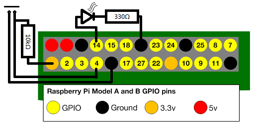

#Raspberry Pi GPIO Example


In this demonstration a raspberry pi running node.js acts as a simple organiq
device, being controlled by a network-connected remote client application 
running on node.js

##Equipment

- 1x Raspberry Pi 2 Model B running Raspbian GNU/Linux 8.0 (jessie) 

- 1x 10k ohm resistor 

- 1x 330 ohm resistor 

- 1x red LED 

- 1x button 

- 1x client running node.js, connected to the device via network, I've tried
it on windows, ubuntu, osX, and another pi running raspian 

###Hardware Setup

Here's a simple raspberry pi setup that consists of a button and an LED.




#Software Setup

###Install Node
**You will need node on both the device and the client** 
 
Raspbian GNU/Linux 8.0 (jessie), the current version included in NOOBS, 
includes node with it. type $node --version to see if it's installed.
```
pi@raspberrypi:~/ws $ node --version
v0.10.29
```

if it's not installed, there are many ways to get it, the easiest (if you 
don't mind an old version) is to type the one of the following:

```
pi@raspberrypi:~/ws $ sudo apt-get install node
pi@raspberrypi:~/ws $ node --version
```
or if that doesn't work,
```
pi@raspberrypi:~/ws $ sudo apt-get install nodejs
pi@raspberrypi:~/ws $ nodejs --version
```

if it is installed, make sure you also have npm(which usually goes everywhere 
node goes, but doesn't seem to be included in Raspian).

if you're missing npm type:
```
pi@raspberrypi:~/ws $ sudo apt-get install npm
```
then type the following to get the version number
```
pi@raspberrypi:~/ws $ npm --version
1.4.21
```


**Make sure you have both node and npm on both the device and the client.**


###Install Organiq 

 **You will need organiq installed in both your device and client application directories, more information can be found [here](https://github.com/organiq/organiq-sdk-js)**


```
pi@raspberrypi:~/ws $ npm init

pi@raspberrypi:~/ws $ npm install organiq                 # install organiq
pi@raspberrypi:~/ws $ npm install --global organiq-cli    # install the command line interface
pi@raspberrypi:~/ws $ organiq register                    # register an Organiq account
pi@raspberrypi:~/ws $ organiq generate-api-key --global   # get an API key 
``` 

 You can get information about organiq by typing in 
 
 ```
pi@raspberrypi:~/ws $ organiq
```
  without any arguements
  
###Install Onoff
**You will need onoff on the raspberry pi device, but not the client** 
https://github.com/fivdi/onoff


```
pi@raspberrypi:~/ws $ npm install onoff
```

  There are other options for GPIO access out there on npm, but this one 
  is by far the best/most frequently updated as of Feb 2016.


##### Notes about using onoff, and rPi GPIO in general

  Most of the pins have a default pullup/pulldown resistor enabled, depending 
  on which pin, I recommend selecting a pin that has the appropriate default 
  for your needs. 
  
  You can find the default settings in Table 6-31 on pages 102 and 103 of the
  BCM2835 ARM Peripherals documentation [here.](https://www.raspberrypi.org/wp-content/uploads/2012/02/BCM2835-ARM-Peripherals.pdf) 
  
  
  You can change this from default to opposite or float, but it's not as easy
  as you'd think. It involves loading another module through npm and to using 
  a device tree overlay to apply changes to the kernel's internal device tree 
  representation. 
  
  You can find instructions on how to do this [here](https://github.com/fivdi/onoff/wiki/Enabling-Pullup-and-Pulldown-Resistors-on-The-Raspberry-Pi) 
  
  As you can see by my circuit diagram in the beginning, I put my own 10kOhm 
  pullup resistor in for good measure.
  
  
#Running the Project

at this point, you should have node, npm, and organiq installed on both device and client, as well as
onoff installed on the device, and api keys on both, obtained through account registration. 


 You can tell if you have an API by typing
 ```
 pi@raspberrypi:~/ws $ organiq current-key
 ``` 
 or
 ```
 pi@raspberrypi:~/ws $ organiq
 ```
without any arguments. This will also give you other helpful information about using organiq.
 

if you don't have an API key ID and secret on both, try the following: 

```
pi@raspberrypi:~/ws $ organiq generate-api-key
```
or try 
```
pi@raspberrypi:~/ws $ organiq register --generate-apikey
```

###Now that that's all sorted out: you should have node, npm, and organiq installed on both device and client, as well as
onoff installed on the device, and api keys on both, obtained through account registration. 


in your device project directory, run pi-device.js on node:

```
pi@raspberrypi ~/ws $ ls
hi.js  node_modules  organiq.json  pi-device.js  pi-device.js.bk
pi@raspberrypi ~/ws $ export DEBUG=organiq:*
pi@raspberrypi ~/ws $ node pi-device.js
```
then, after the debug messages say the device is registered, run pi-client.js on node in your client project directory.

```
C:\Users\CoolGuy\Documents\projects\organiq-raspberry>dir

 Directory of C:\Users\CoolGuy\Documents\projects\organiq-raspberry

02/22/2016  06:18 PM    <DIR>          .
02/22/2016  06:18 PM    <DIR>          ..
02/20/2016  08:35 PM               229 .gitignore
02/22/2016  06:21 PM             2,956 ez-setup.md
02/21/2016  02:33 PM            33,966 gpio-setup.png
02/04/2016  03:20 PM               326 hi.js
02/22/2016  12:22 PM    <DIR>          node_modules
02/04/2016  01:54 PM               206 organiq.json
02/22/2016  12:22 PM               283 package.json
02/22/2016  06:08 PM             1,027 pi-client.js
02/22/2016  06:06 PM             2,789 pi-device.js
               8 File(s)         41,782 bytes
               3 Dir(s)  279,395,717,120 bytes free

C:\Users\CoolGuy\Documents\projects\organiq-raspberry>node pi-client.js
```


You should be able to see them talking to each other, the client will get the button state every second and write it to its console. when it does this, it will also toggle the LED so you have a reference point.


take a look at pi-device.js and pi-client.js to learn more


```javascript
var device = {
  getButtonState : function() { /*console.log('returning false');*/ return _pressed; },
  getLEDState : function() { /*console.log('returning false');*/ return _led; },
  ledOn: function() { _led = 0; writeLED();/*this.emit('ledPress', true); return _led; */},
  ledOff: function() { _led = 1; writeLED();/*this.emit('ledRelease', false); return _led; */}
};
```


  
